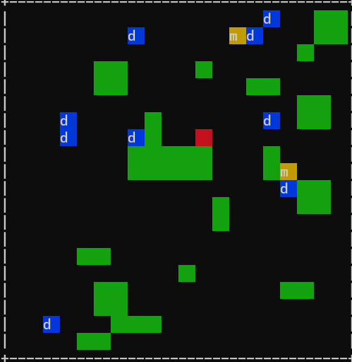

# OOP assign7 小精靈模擬遊戲
這是一款小精靈模擬遊戲，玩家在畫面上移動角色（Player），收集鑽石（Diamond）並躲避怪獸（Monster）以取得勝利。遊戲包含基本碰撞與勝負判斷邏輯。

## 遊戲畫面

## 遊戲玩法
- 玩家可以使用 **WSAD** 移動角色。
- 吃到 5 顆鑽石(藍色d代表)即獲勝。
- 被怪獸(黃色m代表)碰到則遊戲結束。
- 遊戲中牆壁（綠色）會阻擋移動。
- 怪獸在遊戲中會隨機移動。

